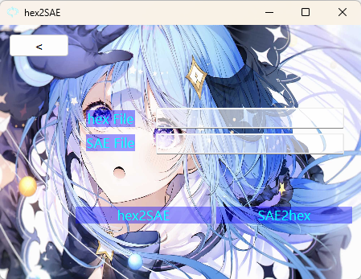

    中文 &nbsp ｜ <a href="../README.md">English</a> &nbsp 

# Tools

Tools是用qt6编写的个人小工具，具有以下功能。
1. 在十六进制编码和SAE编码之间转换。
2. 替换原始字符串中的子字符串。

## 如何构建和打包程序
1. 构建您的配置并运行以获取exe文件。
2. 新建文件夹并放置步骤1中的exe文件。
3. 打开qt自身的命令行(cmd)并转到当前路径。 
> cd path
4. 按如下方式运行命令。
> windeployqt tools.exe
5. 使用`Enigma Virtual Box`打包您的程序。

## 如何使用

### 在十六进制编码和SAE编码之间转换。
1. 点击`hex File`按钮导入十六进制文件。
2. 点击`SAE File`按钮导入十六进制文件。
3. 如果要转换十六进制编码，请单击按钮`SAE2hex`，否则，请单击`hex2SAE`按钮转换SAE编码。
> 注：十六进制文件格式和SAE文件格式可参考测试文件夹中的[hex.txt](test/hex.txt)和[SAE.txt](test/SAE.txt)。

### 替换原始字符串中的子字符串。

1. 将原始字符串填入大空格，将需要替换的子字符串填入小空格。
2. 单击`Input File`按钮导入子字符串文件。
3. 单击`Output File`按钮导入生成文件。
4. 单击`OK`按钮替换原始字符串中的子字符串并写入文件。
> 注：子字符串文件格式可以参考测试文件夹中的[subStrt.txt](test/subStr.txt)。

## todo
- 添加更多功能。
- 优化UI界面。